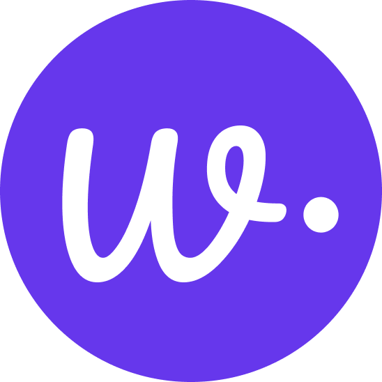

<p align="center">
  
</p>

<h1 align="center">Weam AI</h1>

<p align="center">
  <strong>The #1 Open Source Collaborative AI Platform</strong><br/>
  Chat. Build. Share. Operationalize generative AI across your team with ease.
</p>

<p align="center">
  <a href="https://weam.ai">Website</a> •
  <a href="https://docs.weam.ai">Docs</a> •
  <a href="https://github.com/weam-ai/roadmap">Roadmap</a> •
  <a href="https://discord.gg/X5U8R45b">Discord</a>
</p>

<p align="center">
  <a href="https://github.com/weam-ai/weam/stargazers"></a>
  <a href="https://github.com/weam-ai/weam/forks"></a>
  <a href="https://github.com/weam-ai/weam/issues"></a>
  <a href="https://hub.docker.com/r/weamai/weam"></a>
  <a href="https://github.com/weam-ai/weam"></a>
  <a href="https://github.com/weam-ai/weam"></a>
</p>

---

## What is Weam AI

Imagine if your team had a place to collaborate with AI as naturally as they collaborate with each other.  
**Weam AI** is a fully open-source, self-hosted AI collaboration platform that makes that possible.

Unlike fragmented AI tools, Weam provides unified workspaces where your team can:

- Chat with multiple AI models seamlessly  
- Build custom AI agents and automate workflows via connections  
- Share prompts, insights, and files across teams  
- Scale AI securely — no vendor lock-in

---

## Quick Start Guide

**Perfect for You:**  
Whether you're exploring generative AI, building powerful workflows, or collaborating across teams — our open source platform adapts to the way you work.

**Best for Your Teams:**

| Team             | Example Use Case                                 |
|------------------|--------------------------------------------------|
| Engineering      | Build & deploy AI apps and tools                 |
| Marketing        | Automate campaigns and generate content          |
| HR & Ops         | Streamline internal workflows with smart assistants |
| Customer Support | Create chatbots and AI support agents            |
| Everyone         | Scale AI innovation across your org              |

---

## Core Features

| Feature               | What You Get with Weam AI                                             |
|-----------------------|----------------------------------------------------------------------|
| Multi-LLM Support     | Connect with over 15 leading models, all in one unified interface     |
| Self-Hosted Deployment| Full control over your data and infrastructure                        |
| Team Collaboration    | Advanced workspace tools for real-time multi-user collaboration       |
| Enterprise Integrations| Connect seamlessly with Slack, Gmail, GitHub, Notion, and more      |
| Custom Agents         | Create AI assistants tailored to your department or workflow         |
| Knowledge Management  | Organize and share knowledge using the built-in Brains system         |
| Open Source           | Fully transparent, community-driven, and extensible                  |
| Cost-Efficient        | Pay only for your own API usage — no per-seat pricing                |

---

## Supported AI Models

<table>
  <tr>
    <td align="center"></td>
    <td align="center"></td>
    <td align="center"></td>
  </tr>
  <tr>
    <td align="center"></td>
    <td align="center"></td>
    <td align="center"></td>
  </tr>
</table>

> Plus: Qwen (Alibaba), OpenRouter, and 10+ additional providers

---

## Built-in Integrations

Connect your favorite tools via Model Context Protocol (MCP):

<table>
  <tr>
    <td align="center"><br/><sub>Team Chat</sub></td>
    <td align="center"><br/><sub>Email Management</sub></td>
    <td align="center"><br/><sub>Code Repository</sub></td>
    <td align="center"><br/><sub>Documentation</sub></td>
  </tr>
  <tr>
    <td align="center"><br/><sub>File Storage</sub></td>
    <td align="center"><br/><sub>Scheduling</sub></td>
    <td align="center"><br/><sub>Project Management</sub></td>
    <td align="center"><br/><sub>Request integrations</sub></td>
  </tr>
</table>

---

## Real-World Use Cases

<table>
  <tr><th>Team</th><th>Use Case</th><th>Business Impact</th></tr>
  <tr>
    <td><strong>Engineering</strong></td>
    <td>• GitHub integration<br/>• Technical documentation Q&A<br/>• Automated bug triage</td>
    <td>50% faster code reviews<br/>Reduced documentation overhead</td>
  </tr>
  <tr>
    <td><strong>Marketing</strong></td>
    <td>• Campaign copy generation<br/>• Brand-consistent messaging<br/>• Content optimization</td>
    <td>3x faster content creation<br/>Consistent brand voice</td>
  </tr>
  <tr>
    <td><strong>HR & Operations</strong></td>
    <td>• Employee onboarding automation<br/>• Policy Q&A chatbots<br/>• Internal knowledge base</td>
    <td>80% reduction in repetitive queries<br/>Faster employee ramp-up</td>
  </tr>
  <tr>
    <td><strong>Customer Support</strong></td>
    <td>• Slack/Gmail integration<br/>• Automated ticket classification<br/>• Response suggestions</td>
    <td>40% faster response times<br/>Higher customer satisfaction</td>
  </tr>
</table>

---

## Installation Options

```bash
git clone https://github.com/weam-ai/weam.git
cd weam
docker-compose up -d
```

- Docs: [Quickstart Guide](https://docs.weam.ai/quickstart)
- From Source / Cloud: Coming soon
- Setup Video: Uploading soon

---

## Getting Started

1. Install with Docker (2 minutes)  
2. Add your LLM API keys (OpenAI, Claude, etc.)  
3. Create your first Workspace  
4. Add a Brain with files or data  
5. Start chatting with AI  
6. Invite your team and scale collaboration

---

## Community & Support

- [Discord](https://discord.gg/X5U8R45b)  
- [Docs](https://docs.weam.ai)  
- [GitHub Issues](https://github.com/weam-ai/weam/issues)  
- Email: hello@weam.ai  

---

## Contributing

We welcome contributions of all kinds:

- Star this repo to show your support  
- Report issues you encounter  
- Suggest features on our roadmap  
- Submit pull requests for improvements  
- Improve documentation  
-  Design UI/UX improvements  
- Contributor Guide: `CONTRIBUTING.md`

---

## Security & Privacy

- Self-hosted: Your data never leaves your infrastructure  
- Role-based access: Granular permissions and workspace isolation  
- Audit logs: Complete activity tracking  
- API security: OAuth 2.0 and JWT authentication

---

## License

Weam AI is licensed under a modified Apache License 2.0 with additional terms to:

- Protect fair use and encourage contributions  
- Ensure commercial use guidelines  
- Maintain open source principles  
  See [`LICENSE`](./LICENSE) for full terms.

---

## What's Next?

Check our public [roadmap](https://github.com/weam-ai/roadmap) for upcoming features:

- Advanced analytics dashboard  
- Workflow automation builder  
- Mobile applications  
- Multi-language support  
- Advanced agent marketplace  

---

<p align="center">
  <strong>Built with ❤️ by the Weam AI community</strong><br/>
  <em>Empowering teams to collaborate with AI, not just use it.</em><br/>
  <a href="https://github.com/weam-ai/weam/stargazers">⭐ Star us on GitHub</a> • 
  <a href="https://discord.gg/X5U8R45b">Join our Discord</a> • 
  <a href="https://weam.ai">Visit our Website</a>
</p>
